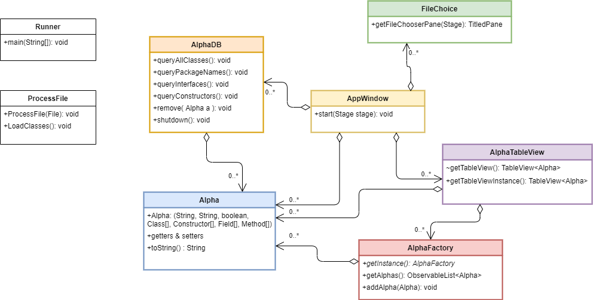

# Advanced Object Oriented Programming and Design Patterns
***
## Final Project

### UML Diagram

### Rationale:
***
I made a couple of design and refactoring choices to promote a more **loosely coupled**, **cohesive** and **robust** design. Firstly, TableView was **abstracted** from AppWindow and the getTableView method is now **encapsulated** within AlphaTableView. File processing was also **abstracted** from AppWindow and is **encapsulated** in it's own class which reads in the jar file, and has a method for compiling an Alpha object which contains all of the necessary metrics. Lastly, the file chooser pane was abstracted into the File Choice class.

### ProcessFile:
***
This class processes the jar file inputted by the user. The jar file is read line and parsed to the correct format. The class is then passed to the getClassInfo method which returns an object Alpha which contains all of the necessary class information such as class name, methods, etc. The Alpha object is then passed to the AlphaFactory instance which adds it to the model.

### FileChoice:
***
This class encapsulates the File Chooser Pane, which is used for uploading the jar file. This was abstracted to allow for a more loosely coupled design.

### AlphaDB:
***
This class manages the MicroStream DB for storing class details. It contains all of the necessary query methods for displaying on the AppWindow.

### AppWindow:
***
This class brings all of the separated class components together, and implements them into a stage, which contains the TableView, file chooser pane, a toolbar which contains multiple buttons for running queries, and text box for displaying query output.

### AlphaTableView:
***
This class was abstracted to encapsulate the getTabeView method. The method is built to display class details. The class details are displayed in multiple columns.

### AlphaFactory:
***
AlphaFactory is a singleton factory that creates a model for the class Alpha that is returned as a factory method. The model is returned as an ObservableList that will configure the TableView.

### Alpha:
***
This is the *class* object that stores the respective metrics for the class (i.e name, package, interfaces). It contains all of the necessary getters and setters, and an overridden toString() method that outputs formatted class details.

